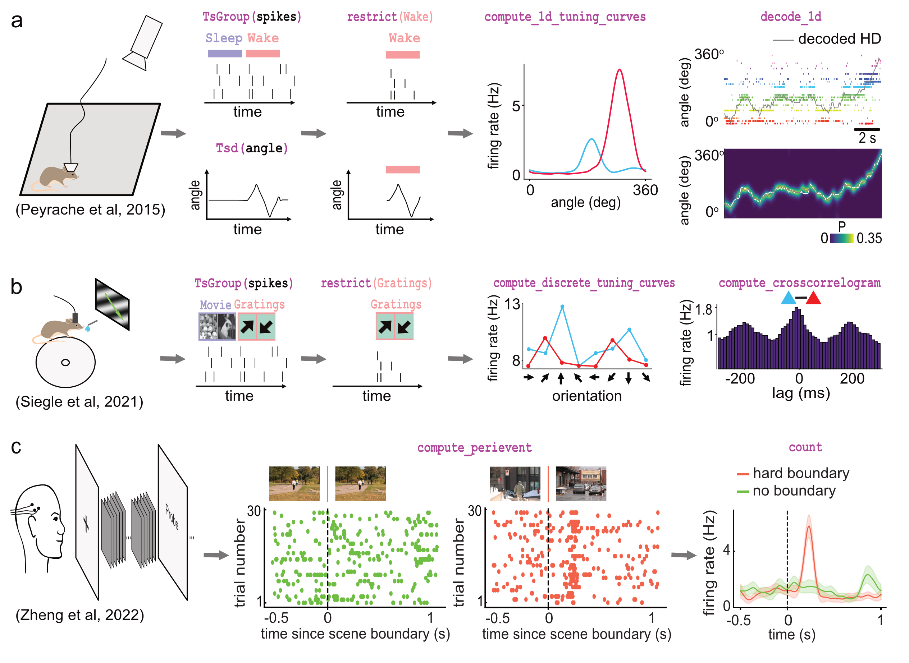

# pynapple-paper-2023
Notebooks of the analysis shown in the 2023 pynapple paper

## Examples of foundational analysis across various electrophysiological datasets using Pynapple. 

<table><tr><td>
    
</td></tr></table>

A) Analysis of an ensemble of head-direction cells. From left to right: data were collected in a freely moving mouse randomly foraging for food; all data are restricted to the wake epoch (i.e., during exploration); the tuning curve of two neurons relative to the animal’s head-direction; animal’s head-direction is decoded from the neuronal ensemble.

 

B) Analysis of V1 neurons during visual stimulation. From left to right: the mouse was recorded while being head-fixed and presented with drifting gratings; spikes, stimulation and epochs are shown; example tuning curves of two V1 neurons, showing their firing rates for different grating orientations; example cross-correlation between two V1 neurons, showing an oscillatory co-modulation at about 5Hz during visual stimulation. 
 

C) Analysis of medial temporal lobe neurons in human epileptic subjects. From left to right: subjects, implanted with hybrid deep electrodes, were shown a series of short clips; raster plot of a single neuron around continuous movie shot trials (green) and hard boundary trials, which are transitions between two unrelated movies (orange); peri-event neuronal firing rate for both trial types.
